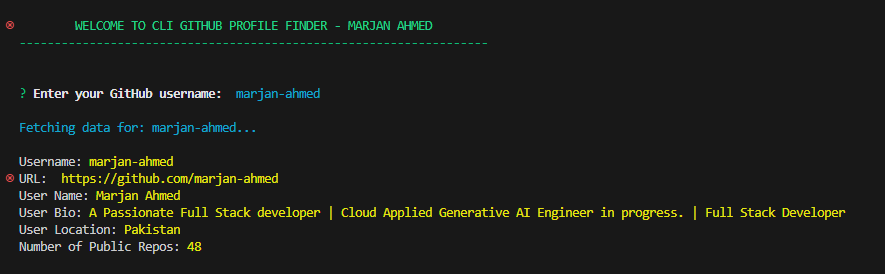

# GithHub Profile Finder

A CLI tool to fetch and display GitHub user data.

## Description

This project is a command-line interface (CLI) tool built with TypeScript that allows users to fetch and display GitHub user data. It uses the GitHub API to retrieve user information and displays it in a formatted manner using the `chalk` library for styling the output.

## Features

- **Prompt User for GitHub Username**: The tool prompts the user to enter a GitHub username using `inquirer`.
- **Fetch GitHub User Data**: It fetches user data from the GitHub API, including username, profile URL, name, bio, location, and the number of public repositories.
- **Styled Output**: Displays the fetched information in a clear and styled format using `chalk`.
- **Error Handling**: Provides appropriate feedback for invalid usernames or API errors.
- **Command-Line Interface**: Easy-to-use CLI interface for quick and efficient user interaction.

### Instructions

1. Replace `your-username` with your actual GitHub username.
2. Replace `Your Name` with your actual name.
3. Save this content as `README.md` in the root of your project directory.

This README file now includes detailed sections on the features of your project and how others can contribute to it, providing a comprehensive guide for users and potential contributors.

## Installation

### Prerequisites

- [Node.js](https://nodejs.org/en/) (version 12 or higher)
- [npm](https://www.npmjs.com/)

# Contributing are Welcome
Contributions are welcome! If you'd like to contribute, please follow these steps:

1. Fork the repository.
2. Create a new branch (git checkout -b feature-branch).
3. Make your changes.
4. Commit your changes (git commit -m 'Add some feature').
5. Push to the branch (git push origin feature-branch).
6. Open a pull request.

Please ensure your code adheres to the existing code style and includes appropriate tests.

### Steps

1. Clone the repository:

```sh
git clone https://github.com/marjan-ahmed/Cli-GitHub-Profile-Viewer.git
cd Cli-GitHub-Profile-Viewer
```

## Result
